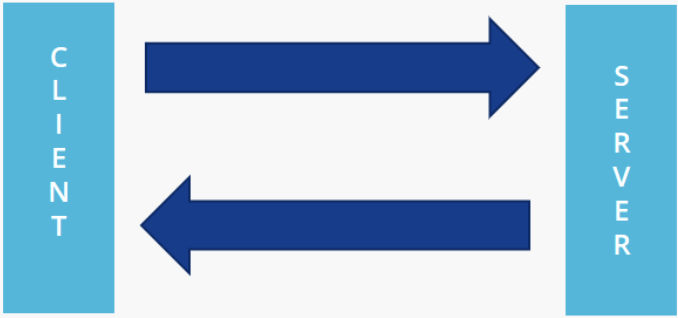
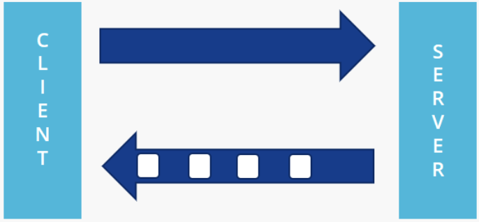
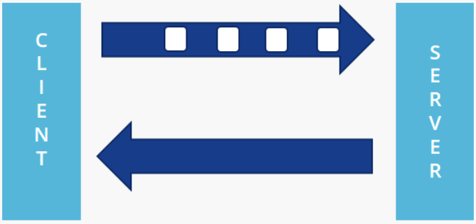
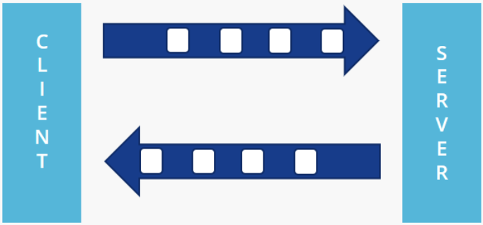

# gRPC Modes of Communication

gRPC is an inter-process communication technology that makes communication between microservices faster and more efficient. It supports four fundamental communication patterns:

## Unary
<figure markdown>
  { loading=lazy }
  <figcaption>Client sends a single request to the server and waits for a single response.</figcaption>
</figure>

## Server Streaming

<figure markdown>
  { loading=lazy }
  <figcaption>Client sends a request to the server, and the server responds with a stream of messages.</figcaption>
</figure>

## Client Streaming

<figure markdown>
  { loading=lazy }
  <figcaption>Client sends a stream of messages to the server, and the server responds with a single message.</figcaption>
</figure>

## Bidirectional Streaming

<figure markdown>
  { loading=lazy }
  <figcaption>Both the client and the server to send and receive a stream of messages.</figcaption>
</figure>

