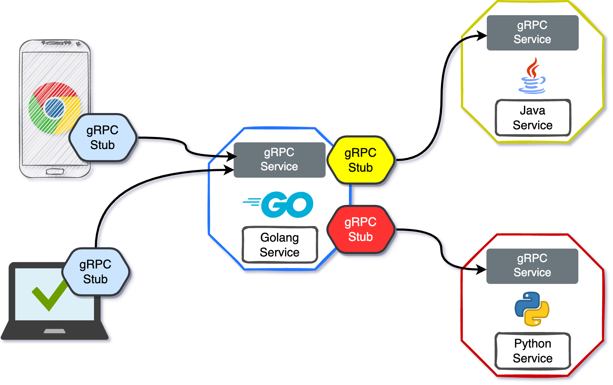
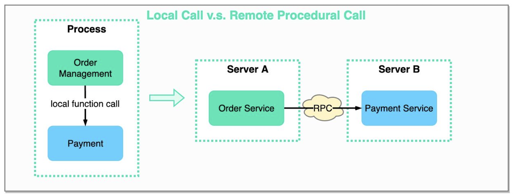
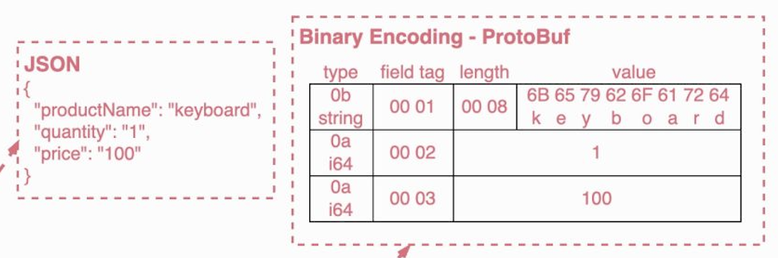
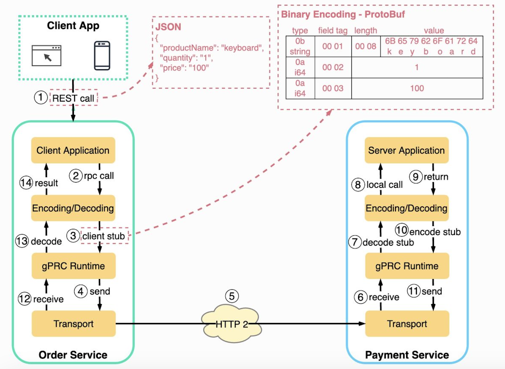

# Google Remote Procedure Calls (gRPC)

**gRPC** is a fast, open-source **RPC** framework for seamless communication between distributed systems.

The framework is based on a **client-server** model of **remote procedure calls(RPC)**. A {++client application++} can {==directly call methods==} on a {++server application++} as if it was a **local object/function**.

<figure markdown>
  { loading=lazy }
  <figcaption></figcaption>
</figure>

#### What are Remote Procedure Calls (RPC)?
It's a **_communication protocol_** that simply **allows** {++a program on one computer(client-side)++} to {==invoke a function==} on a {++remote computer(server-side)++}

<figure markdown>
  { loading=lazy }
  <figcaption>It simply enables remote function calls that mimic local function calls but execute on remote machines.</figcaption>
</figure>


#### What is Protocol Buffer (Protobuf)?
Is a language-agnostic {==binary serialization==} format developed by Google. It can be used as a {++data format++} within **RPC implementations**.
<figure markdown>
  { loading=lazy }
  <figcaption></figcaption>
</figure>

#### What is `.proto` file?

It's the file where you define your data structures and services using the Protocol Buffers IDL (Interface Definition Language).

```proto
syntax = "proto3";

package taskPackage;

// Request Parameter Definition
message Request {
    string id = 1;
    string description = 2;
}

// Response Parameter Definition
message Response {
    string transactionId = 1;
}

// Service Definition
service TaskService {
    rpc createTask (Request) returns (Response);
}
```

The `.proto` files act as the **blueprint** for {++generating code++} in [different programming languages](https://grpc.io/docs/languages/) for working with the {==defined data structures and services.==}


## gRPC Overall Flow

<figure markdown>
  { loading=lazy }
  <figcaption></figcaption>
</figure>